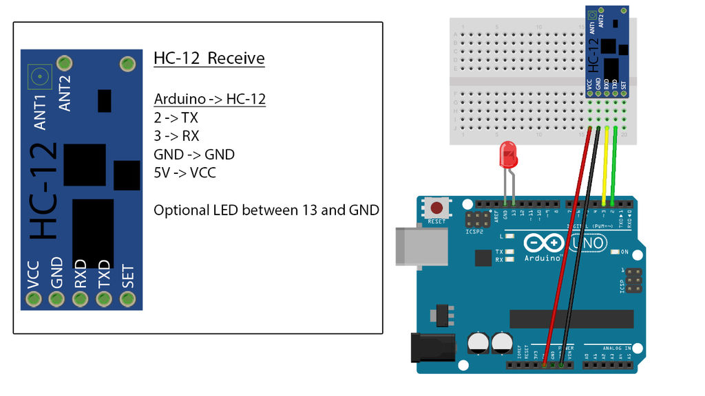

# HC-12
HC-12 sketches for Arduino

The HC-12 modules should be connected in the following way. Image is from Tom Heylen.

The above schematic shows the transmitter mode setup. To enter the AT command mode,
one should connect the SET pin to ground.

An important future improvement to this code is to implement a proper communication
protocol such as [XMODEM](http://en.wikipedia.org/wiki/XMODEM) or [HDLC](http://en.wikipedia.org/wiki/High-Level_Data_Link_Control).
